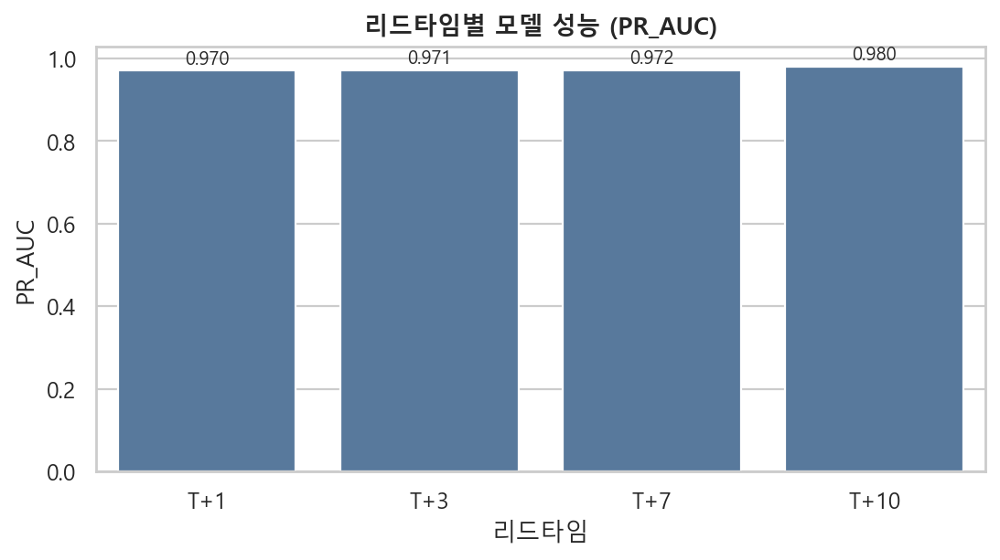
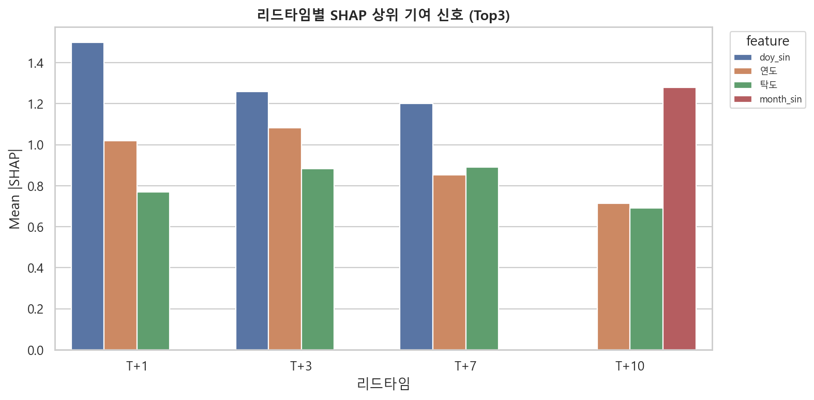
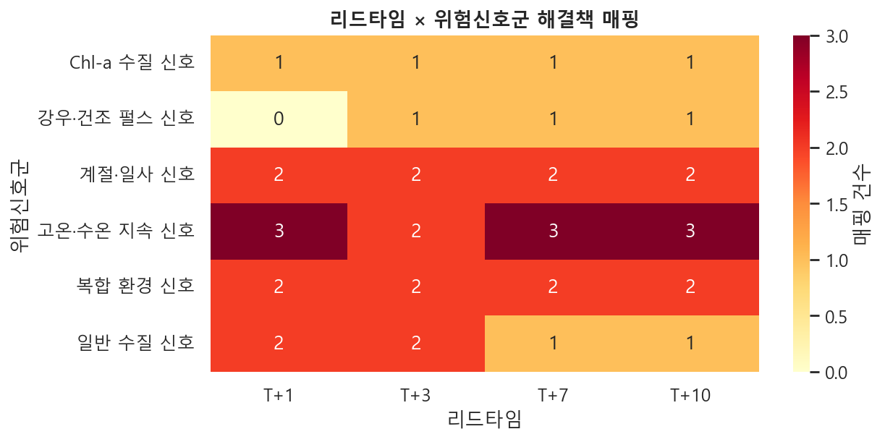
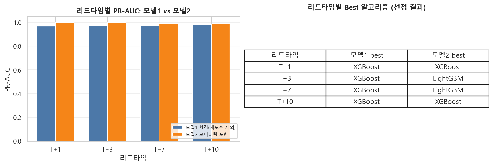
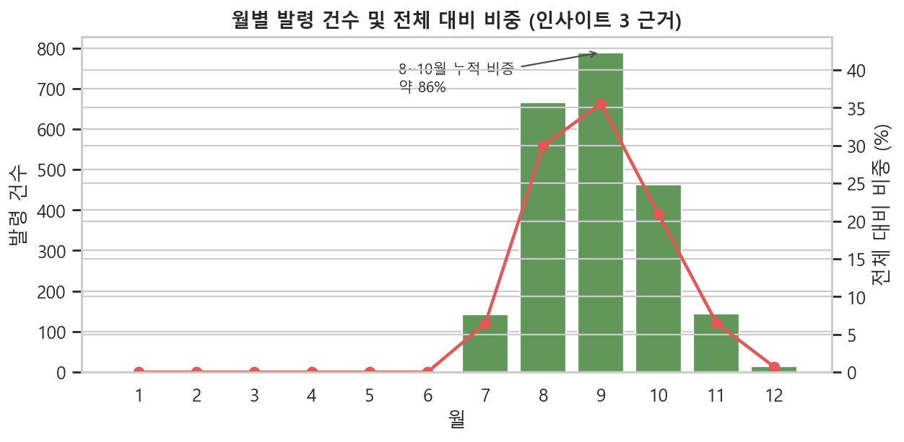
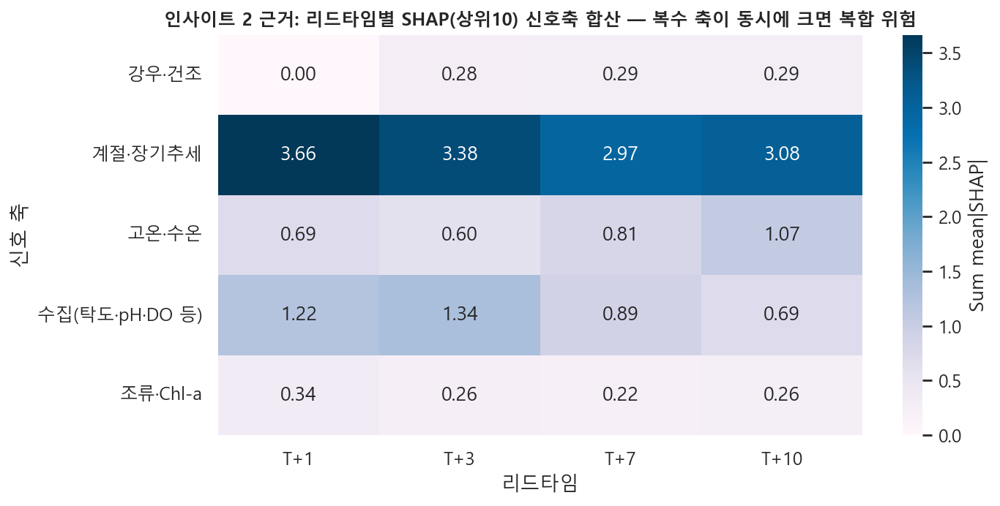
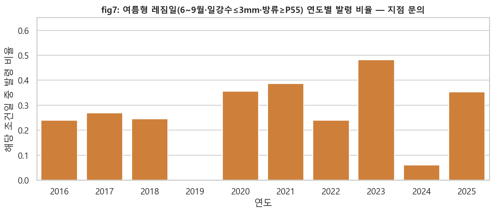
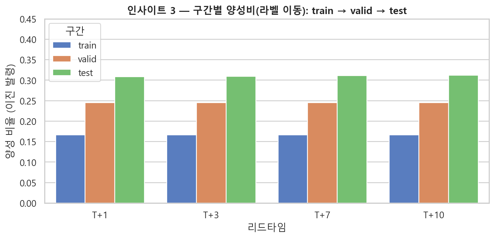
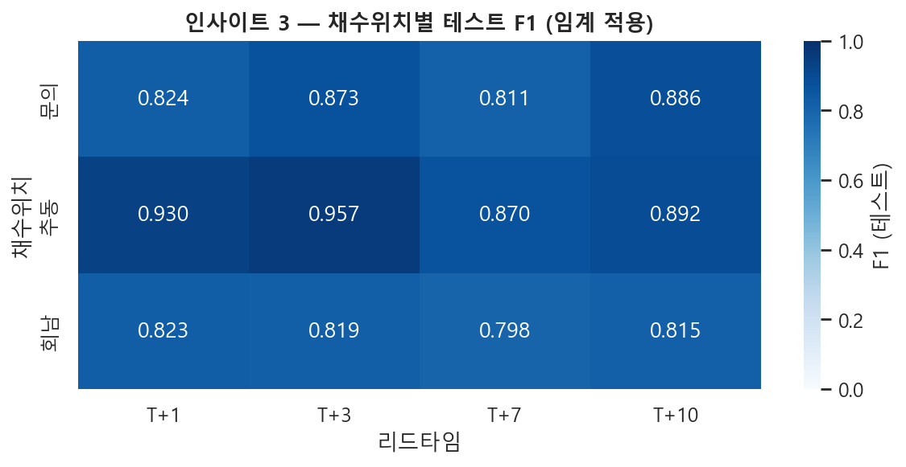

## Ⅳ. 인사이트 및 해결책

**모델 구분** · **모델1**: 조류 세포수 직접 신호를 제외한 환경·수문·댐 운영 기반 사전예측 (`outputs/modeling_env/`) · **모델2**: 모니터링(세포수 등)을 포함한 보조 예측 (`outputs/modeling/`)

**[지정분석] 요구와 본 과제 범위** · “최적 입지(좌표)”나 “예측 수치 하나로 확정”은 본 데이터가 **기존 채수 3지점 시계열**인 한계 안에서는 다루지 않는다. 대신 **리드별 확률·임계 적용 결과·시나리오별 확률 변화·권장 조치 체크리스트**를 제공한다.

---

조류경보 위험은 단일 요인의 변화만으로 설명되기보다, **수온·강우·체류·유량 등 여러 환경·운영 조건이 한꺼번에 어긋날 때** 더 크게 드러나는 경향이 있었다. 이러한 정리는 리드타임별 모델 성능을 비교하고, SHAP으로 기여 변수를 살보며, 시나리오·What-if로 위험 확률이 어떻게 움직이는지 함께 읽는 과정에서 도출되었다. 다만 “좌표 하나·수치 하나”로 현장을 대체할 수 있다는 뜻은 아니다. 본 패널은 **기존 채수위치(문의·추동·회남)** 단위의 시계열이며, 최종 판단은 담당자가 **임계와 리스크 허용도**를 두고 내리는 **의사결정 지원**에 가깝다.

---

### 인사이트 1 — 리드타임별 위험 구조가 다르다

동일 채수지점·동일 시점 조건을 두고도 `T+1`, `T+3`, `T+7`, `T+10` 모델은 **위험 확률의 크기**와 **SHAP 상위 기여 변수**가 서로 달랐다. PR-AUC는 리드마다 높은 수준을 유지하는 구간이 있으나(예: fig1), **어떤 변수가 위험을 “읽는지”는 리드마다 달라진다**(fig2). 모델2는 리드에 따라 최적 알고리즘이 갈리고(fig4), 모델1도 리드마다 별도 학습·임계를 갖는다. 따라서 **하나의 선행창·하나의 지표**만으로 모든 대응을 묶기 어렵고, **리드타임마다 다른 선행창과 대응 강도**를 두는 것이 타당하다.

**해결책** · 리드타임별로 **모델·임계·SHAP**를 묶어 두고, 운영 화면에서는 동일 조건을 `T+1`~`T+10`에 동시에 올려 **어느 창에서 먼저 신호가 켜지는지**를 회의 안건으로 본다. `scenario_recommendation.csv`에 정리된 **신호군별 권장 조치**를 체크리스트로 쓴다.

**시각자료** · fig1(리드별 PR-AUC) · fig2(SHAP 상위) · fig4(M1 vs M2) · fig3(리드×신호군 매핑)

---

### 인사이트 2 — 위험 상승은 복합 신호에서 더 크게 드러난다

고온·수온 축, 강우·무강우·강우 펄스, 계절 위상, 체류(HRT)·유량 균형, 수질(탁도·pH·Chl-a) 등이 SHAP 상위권에 **동시에** 올라오는 리드가 다수였다. `scenario_recommendation`과 fig3·fig6을 같이 보면, **한 축만 튄 날**보다 **여러 축이 겹친 날**에 대응 매핑이 늘어나 **복합 운영 시나리오**가 요구된다는 뉘앙스가 드러난다.

**해결책** · 폭염·가뭄·장마 후·방류 증량 등 **복합 프리셋**을 What-if에 두고, CHD·dry_days·rain_pulse·HRT·유량이 **함께** 움직일 때 위험 확률이 얼마나 변하는지를 **정책·운영 논의**의 출발점으로 삼는다. 단일 변수 알람만으로는 같은 날의 “겹침”을 설명하기 어렵다는 점을 발표에서 분명히 한다.

**시각자료** · fig2 · fig3 · fig6

---

### 인사이트 3 — “더 나누면 자동으로 좋아진다”는 아니다: 라벨·층위·부정실험

테스트 구간으로 갈수록 **이진 발령의 비율(양성비)이 학습기보다 높게** 잡히는 등, **라벨 분포가 구간마다 달라진다**(fig8, `test_train_valid_test_label_shift.csv`). 같은 리드에서도 **채수위치별 F1**이 달라(fig9, `test_insight_slices.csv`), **한 장의 평균 숫자만으로 현장 전체를 대표하기 어렵다**. 여기에 더해, **6~9월만 따로 학습**한 모델과 **전 기간** 모델을 여름 테스트에 맞춰 비교했을 때(`summer_vs_full_jja_test_metrics.csv`)는 PR-AUC·보정 기준으로 **여름 전용이 전반적으로 우월하다고 보기 어렵다**는 쪽에 가깝고, **동일 모델에 여름·겨울 임계만 나눈 운영**(`seasonal_operating_threshold_test.csv`)은 이번 튜닝 규칙에서는 **재현율·F1이 오히려 깎이는 리드**도 있었다. 즉 **“쪼갤수록 좋아진다”가 아니라, 불필요한 복잡도를 줄일 근거**를 데이터로 확보한 것이 이 절의 의의다.

**해결책** · 발표에서는 PR-AUC만 내세우기보다 **양성비 이동(fig8)**과 **지점별 성능(fig9)**을 함께 보여 **해석의 전제**를 밝힌다. 여름-only·계절 임계는 **부록 숫자**로 두고, 우선은 **리드 맞춤·복합 시나리오·What-if**에 운영 무게를 둔다. 월·연도로 잘라낸 지표는 일부 달에 **표본이 작고 양성비가 극단**인 경우가 있어, **시기 집중(fig5)**은 말하되 **월 단위 미세 비교**는 신중히 쓴다.

**시각자료** · fig8 · fig9 · (부록) fig5 · fig7(생성 시)

---

### 인사이트 4 — 계절·시기적으로 발령이 몰린다

월별로 보면 발령이 **하반기에 강하게 집중**되는 패턴이 있다(fig5). 기온→수온 지체와 맞물려, **7월 말~8월 초부터** `T+7`·`T+10` 선행창과 채수·수온 감시를 강화할 **시간적 근거**로 쓸 수 있다. 다만 인사이트 3에서 밝힌 것처럼, **“여름만 따로 모델”이나 “임계만 계절 분리”가 자동으로 이득**이라고 말할 수는 없다.

**해결책** · 여름첨 **모니터링·회의 빈도**를 올리는 운영 문구는 fig5·fig7과 연결하되, 모델 구조를 늘리기 전에는 **인사이트 3의 부정실험 결과**를 한 문장이라도 덧붙여 과장을 피한다.

**시각자료** · fig5 · fig7(코드 셀 생성 시)

---

### 한 줄로 묶으면 (발표 클로징용)

**“위험은 리드마다 다르게 읽히고, 여러 신호가 겹칠 때 커진다. 계절·여름만 쪼갠다고 자동으로 좋아지지는 않았고, 테스트는 더 ‘발령 많은 시기’에 가깝다는 점까지 밝혔다. 그래서 복잡한 규칙을 늘리기 전에, 리드·복합 신호·What-if에 무게를 두는 것이 합리적이다.”**

---

### 재현·그림 경로 (발표·노트북용)

그림은 `outputs/modeling_env/figures/insight_solution/` 에서 fig1~fig7(노트북 Ⅳ-4 셀 등), fig8·fig9는 `python generate_insight_figures.py` 실행 시 진단 CSV가 있으면 함께 생성된다. 표·CSV는 `outputs/modeling_env/tables/` (`best_model_summary.csv`, `shap_top_features.csv`, `scenario_recommendation.csv`, `test_insight_slices.csv`, `test_train_valid_test_label_shift.csv`, `summer_vs_full_jja_test_metrics.csv`, `seasonal_operating_threshold_test.csv` 등).

